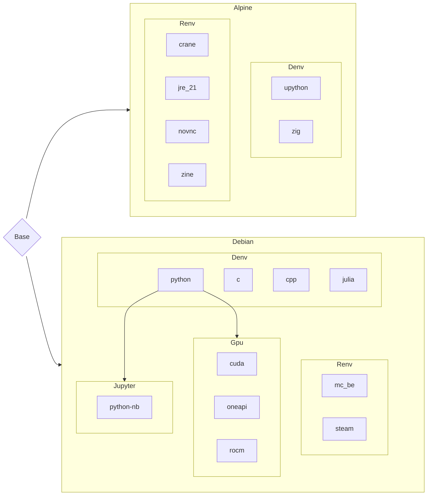

# Cenv
**codeberg.org: codeberg.org/eoelab/cenv:TAG**

## Platform
* ARCH: x86_64
* OS: 
    * debian sid
    * alpine edge
* ROCM: 7.2.0
* CUDA: >= 13.1

## Container Create
**Cenv run as root**
1. oci: `podman run`, See the devcontainer config file for more information.
2. devcontainer(VScode): `cp -r .devcontainer WORKDIR`

## Denv
1. `git` may not be loaded on the first run. Please `Reload Window`.
    1. Press Ctrl + Shift + P (Windows/Linux) or Cmd + Shift + P (macOS) to open the Command Palette.
    2. Type `Reload Window` in the search bar.
    3. Select the `Reload Window` command.
2. c/cpp environment: `.vscode` config may not be loaded on the first run. Please `Reload Window` to ensure the configuration is loaded.
    1. if you need source, please run `sed -i 's/Types: deb/Types: deb deb-src/' /etc/apt/sources.list.d/debian.sources`
3. upython(micropython): 
    1. run `sudo usermod -aG dialout $USER` before use container, add youself to `dialout`
    2. hardware -> tty:
        * raspberry pico: `/dev/ttyACM0`
        * raspberry pi: `/dev/ttyUSB0`
    3. stub(support pylance): `pip install micropython-XXX-stubs`, search on `pypi.org`.

## GPU
1. cuda:
    1. **Make sure you have installed the [NVIDIA driver](https://docs.nvidia.com/datacenter/cloud-native/container-toolkit/install-guide.html#nvidia-drivers) for your Linux Distribution**
    2. **Note that you do not need to install the CUDA Toolkit on the host system, but the NVIDIA driver needs to be installed**
    3. For instructions on getting started with the NVIDIA Container Toolkit, refer to the [installation guide](https://docs.nvidia.com/datacenter/cloud-native/container-toolkit/install-guide.html#installation-guide)
    4. for china,maybe need a mirror site: run `sed -i 's/developer.download.nvidia.com/developer.download.nvidia.cn/g' /etc/apt/sources.list.d/cuda-debian13-x86_64.list`
2. rocm: 
    1. run `sudo usermod -aG video,render $USER` before use container, add youself to `video`,`render`
    2. how to run jax/flax:
        1. apt install rocm
        2. see [rocm-jax](https://github.com/ROCm/rocm-jax/releases)
    3. for china,maybe need a mirror site:
        1. run `sed -i 's/repo.radeon.com/radeon.geekery.cn/g' /etc/apt/sources.list.d/amdgpu.list`
        2. run `sed -i 's/repo.radeon.com/radeon.geekery.cn/g' /etc/apt/sources.list.d/rocm.list`
    4. how to run pytorch: PyTorch doesn’t require user-space ROCm support;
        1. run `pip install --pre torch torchvision --index-url https://download.pytorch.org/whl/nightly/rocm7.1`
3. oneapi:
    1. Install the compute-related packages: apt install libze-intel-gpu1 libze1 intel-metrics-discovery intel-opencl-icd clinfo intel-gsc
    2. Install the media-related packages(Optional): apt install intel-media-va-driver-non-free libmfx-gen1 libvpl2 libvpl-tools libva-glx2 va-driver-all vainfo
    3. For PyTorch: apt install libze-dev intel-ocloc
    4. enable hardware ray tracing support(Optional): apt install libze-intel-gpu-raytracing
    5. install Intel Deep Learning Essentials: apt install intel-deep-learning-essentials-2025.3

## Jupyter
1. For commercial software such as Mathematica, MATLAB, etc., we only provide packaging, and the specific activation method and possible consequences are borne by the user
2. The following code fixes the issue of missing Chinese characters in matplotlib plots.(You need to install `wqy-zenhei` beforehand.)
    ```
    from matplotlib.font_manager import FontProperties
    # Set the path to the Chinese font
    zh_font = FontProperties(fname="/usr/share/fonts/truetype/wqy/wqy-zenhei.ttc")
    # Set the Chinese font as the default font in matplotlib
    plt.rcParams["font.family"] = zh_font.get_name()
    ```
3. Jupyterlab plugins
    * **jupyterlab-language-pack-zh-CN**:Support for Chinese
    * **jupyterlab-lsp**：It is used for autocompletion, parameter suggestion, function document query, and jump definition
    * **jupyterlab-execute-time**: Displays the execution time of each cell
    * **jedi-language-server**: Python Language server
4. python-nb: benchmarking against the jupyter official minimal-notebook image

## Image dependencies
* `Denv` : Development environment
* `Renv`: Runtime environment
* `Gpu`: GPU environment
* `Jupyter`: Jupyterlab environment




## Mirror source
* debian ustc：https://mirrors.ustc.edu.cn/help/debian.html