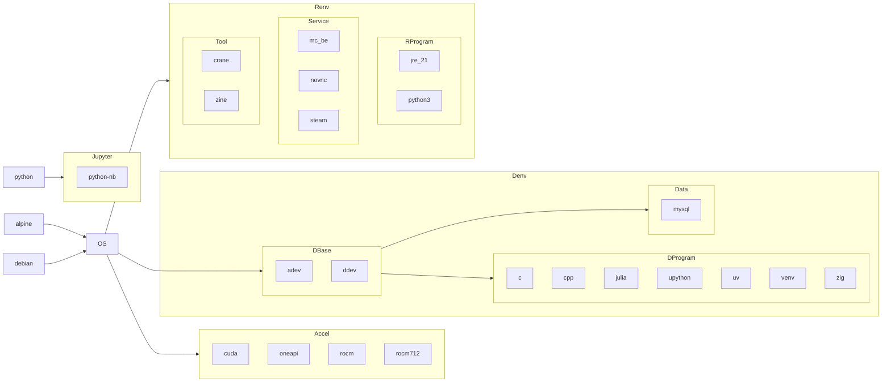

# Cenv
**codeberg.org: codeberg.org/eoelab/cenv:TAG**

Everyone has different use cases and requirements. The goal of cenv is not to exhaustively cover and package every possible combination, but to provide a base environment along with essential devcontainer configuration files. For more specific or advanced needs, users can customize the `devcontainer.json` themselves, which is generally not complicated. 
For example, if you need uv-related configurations, you can refer to the uv configuration files we provide and integrate them into your own setup, such as combining them with services like MySQL.


## Container Create
**Cenv run as root**
1. oci: `podman run`, See the devcontainer config file for more information.
2. devcontainer(VScode): `cp -r .devcontainer WORKDIR`

## OS
* ARCH: x86_64
* OS: 
    * debian sid
    * alpine edge

## Storage
Containers themselves are stateless, but in practice some data still needs to be persisted. We categorize such data into two types: **workspace** and **cache**.

* **workspace**: the directory where the container performs its actual work. It is typically fixed at `/workspace` (in devcontainer, this corresponds to `/workspaces/<WORKDIR>` by default).

* **cache**: while still stateless in nature, benefits from local persistence to improve performance. Therefore, in development environments like Denv, devcontainer automatically configures cache persistence.

The cache consists of two parts:

* **cache**: tool-level caches
    * pip: /cache/pip
    * uv: /cache/uv
    * ccache: /cache/ccache
* **runtime**: runtime-related data
    * uv_cpython: /runtime/uv_cpython


## Accel
1. cuda: >= 13.1
    1. **Make sure you have installed the [NVIDIA driver](https://docs.nvidia.com/datacenter/cloud-native/container-toolkit/install-guide.html#nvidia-drivers) for your Linux Distribution**
    2. **Note that you do not need to install the CUDA Toolkit on the host system, but the NVIDIA driver needs to be installed**
    3. For instructions on getting started with the NVIDIA Container Toolkit, refer to the [installation guide](https://docs.nvidia.com/datacenter/cloud-native/container-toolkit/install-guide.html#installation-guide)
    4. for china,maybe need a mirror site: run `sed -i 's/developer.download.nvidia.com/developer.download.nvidia.cn/g' /etc/apt/sources.list.d/cuda-debian13-x86_64.list`
2. oneapi:
    1. Install the compute-related packages: apt install libze-intel-gpu1 libze1 intel-metrics-discovery intel-opencl-icd clinfo intel-gsc
    2. Install the media-related packages(Optional): apt install intel-media-va-driver-non-free libmfx-gen1 libvpl2 libvpl-tools libva-glx2 va-driver-all vainfo
    3. For PyTorch: apt install libze-dev intel-ocloc
    4. enable hardware ray tracing support(Optional): apt install libze-intel-gpu-raytracing
    5. install Intel Deep Learning Essentials: apt install intel-deep-learning-essentials-2025.3
3. rocm: 7.2.1
    1. run `sudo usermod -aG video,render $USER` before use container, add youself to `video`,`render`
    2. how to run jax/flax:
        1. apt install rocm
        2. see [rocm-jax](https://github.com/ROCm/rocm-jax/releases)
    3. for china,maybe need a mirror site:
        1. run `sed -i 's/repo.radeon.com/radeon.geekery.cn/g' /etc/apt/sources.list.d/amdgpu.list`
        2. run `sed -i 's/repo.radeon.com/radeon.geekery.cn/g' /etc/apt/sources.list.d/rocm.list`
    4. how to run pytorch: PyTorch doesn’t require user-space ROCm support;
        1. see [pytorch](https://pytorch.org/)
4. rocm712: 
    1. run `sudo usermod -aG video,render $USER` before use container, add youself to `video`,`render`
    2. how to use:
        1. see [rocm-preview](https://rocm.docs.amd.com/en/7.12.0-preview/)

## Denv
1. For devcontainer container setup, the following commands are executed in order: **`onCreateCommand` → `updateContentCommand` → `postCreateCommand`**
    * By default, we use **`onCreateCommand` & `updateContentCommand`** to perform the initial development container setup.
    * If these scripts do not fully meet your needs, please use **`postCreateCommand`** to add your own custom steps.
2. c/cpp environment: `.vscode` config may not be loaded on the first run. Please `Reload Window` to ensure the configuration is loaded.
    1. if you need source, please run `sed -i 's/Types: deb/Types: deb deb-src/' /etc/apt/sources.list.d/debian.sources`
3. upython(micropython): 
    1. run `sudo usermod -aG dialout $USER` before use container, add youself to `dialout`
    2. hardware -> tty:
        * raspberry pico: `/dev/ttyACM0`
        * raspberry pi: `/dev/ttyUSB0`
    3. stub(support pylance): `pip install micropython-XXX-stubs`, search on `pypi.org`.
4. uv/venv: By default, venv environment is not created automatically. 
    * uv: use:`uv venv --python PYTHON_VERSION .venv` to create it.
    * venv: use:`python3 -m venv .venv` to create it.

## Jupyter
1. For commercial software such as Mathematica, MATLAB, etc., we only provide packaging, and the specific activation method and possible consequences are borne by the user
2. The following code fixes the issue of missing Chinese characters in matplotlib plots.(You need to install `wqy-zenhei` beforehand.)
    ```
    from matplotlib.font_manager import FontProperties
    # Set the path to the Chinese font
    zh_font = FontProperties(fname="/usr/share/fonts/truetype/wqy/wqy-zenhei.ttc")
    # Set the Chinese font as the default font in matplotlib
    plt.rcParams["font.family"] = zh_font.get_name()
    ```
3. Jupyterlab plugins
    * **jupyterlab-language-pack-zh-CN**:Support for Chinese
    * **jupyterlab-lsp**：It is used for autocompletion, parameter suggestion, function document query, and jump definition
    * **jupyterlab-execute-time**: Displays the execution time of each cell
    * **jedi-language-server**: Python Language server
4. python-nb: benchmarking against the jupyter official minimal-notebook image

## Image dependencies

```mermaid
graph LR

%% -------- OS --------
alpine --> OS
debian --> OS

%% -------- Accel --------
OS --> Accel
subgraph Accel
    cuda
    oneapi
    rocm
    rocm712
end

%% -------- Denv --------
OS --> DBase
subgraph Denv
    DBase --> DProgram
    DBase --> Data

    subgraph DBase
        adev
        ddev
    end

    subgraph DProgram
        c
        cpp
        julia
        upython
        uv
        venv
        zig
    end

    subgraph Data
        mysql
    end
end

%% -------- Renv --------
OS --> Renv
subgraph Renv
    RProgram
    Service
    Tool

    subgraph RProgram
        jre_21
        python3
    end

    subgraph Service
        mc_be
        novnc
        steam
    end

    subgraph Tool
        crane
        zine
    end
end

%% -------- Jupyter --------
python --> Jupyter
subgraph Jupyter
    python-nb
end
```
## Mirror source
* alpine ustc：https://mirrors.ustc.edu.cn/help/alpine.html
* debian ustc：https://mirrors.ustc.edu.cn/help/debian.html
* julia cernet：https://mirrors.cernet.edu.cn/julia
* pip ustc：https://mirrors.ustc.edu.cn/help/pypi.html
* zig zigmirror：https://zigmirror.com